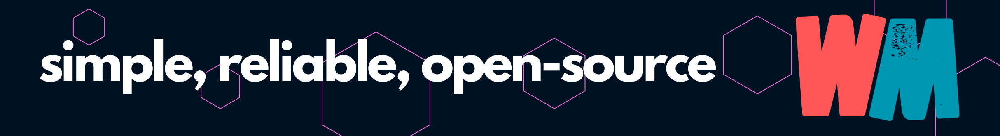
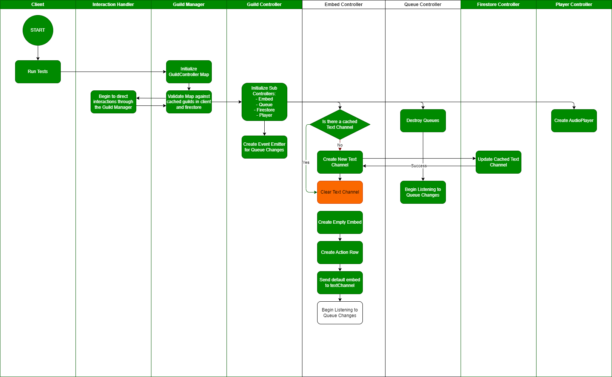
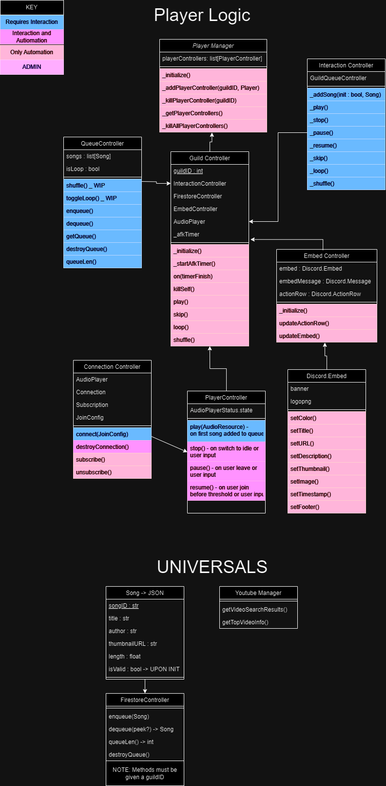

# Wall Music Discord Application



## Install Easily for Free

- [Invite Wall Music (INACTIVE DURING DEVELOPMENT)](/)
- Find the new #wall-music-channel text channel. Feel free to move the channel anywhere in your server.
- Type in a song and press play, no command necessary!

## The Solution to Simple Music Streaming

Everybody know the struggle of searching for a song 237 times before *finally* hearing the song you searched for. Wall Music's Web App (WIP), availabile on web and mobile, solves this problem by implementing an intuitive search feature.

Server administrators know the mess that results when users use music bot commands *everywhere*. #general is infested with music commands, the queue is impossible to find, and all the sudden something as simple as music becomes an unneccessary hassle to moderate.

## Commandless Discord Music Streaming App

Avoid the user experience nightmare and use an application that is simple, robust, and open-source.

Advanced customization options, enhanced queue controll, permissions, and better song searching will be available in the Web App (WIP) by logging in with your Discord Account.

## For Developers

If you'd like to clone this repo and host Wall Music yourself, follow these steps:

**1. Have node.js installed**
**2. Install dependencies**

``` console
npm i
```

**3. Create your config files in './src'**

- discordConfig.json
  - Get your bot token in the [Discord Developer Portal](https://discord.com/developers/applications/)
  - Create a new Application
  - Invite the bot to your server
  - Get your private token
  
``` json
./src/discordConfig.js

{
  "token": "YOUR_BOT_TOKEN",
  "clientId": "WALL_MUSICS_ID",
  "devGuildId": "DEVELOPMENT_GUILD_ID",
  "devTestChannelId": "DEVELOPMENT_CHANNEL_ID"
}
```

- firebaseConfig.json
  - Create a Firebase Project
  - Create a Cloud Firestore database
  - Allow reading/writing to database
  - Go to Project Settings > Service Accounts > Generate New Private Key
  - Rename downloaded json to firebaseConfig.json
  - Add to ./src/ directory

- youtubeConfig.json
  - Create a new Google Cloud Project
  - Search for [Youtube Data API v3](https://console.cloud.google.com/marketplace/product/google/youtube.googleapis.com?q=search&referrer=search)
  - Add this API to your project
  - Go to APIs & Services > Credentials > API Key 2 > SHOW KEY

``` json
./src/youtubeConfig.json

{
  "youtubeApiKey": "YOUR_API_KEY"
}
```

**4. Start the bot!**

``` console
node .
```

**NOTE**: If you followed these instructions and cannot start the bot, please create an issue.

## Planning

### Initialization Process

**KEY**: Green is completely implemented and automated, orange is non-priority, and black is TODO.


### Class Diagram **OUTDATED**



## About the Developer


What's up, my name's Luke. I just graduated with a bachelor's in computer scinece from The University of Montana and need something to over-engineer while searching for a job. I have always loved building Disord bots, but I've never had the foresite to plan a production level project until now. Check out the [planning](./planning) folder to see my process.
